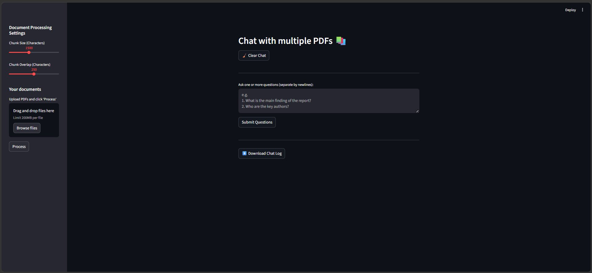
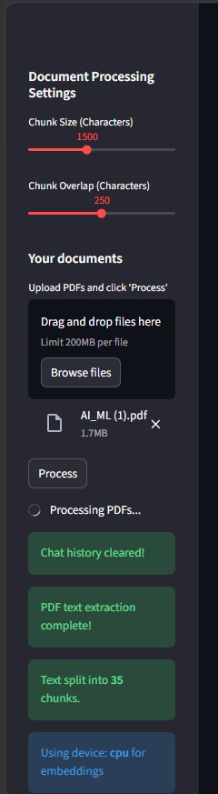
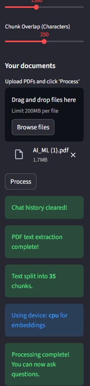
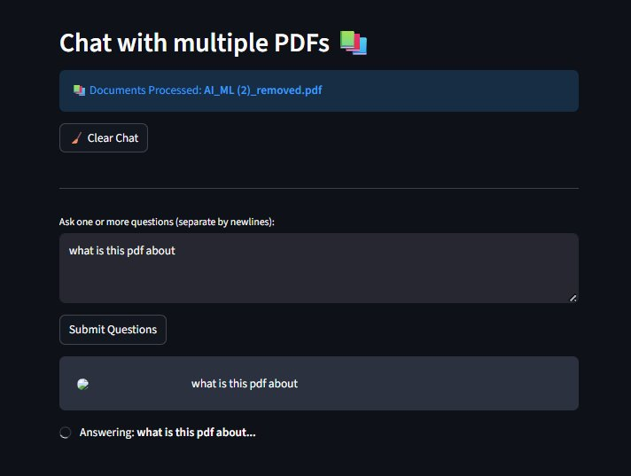
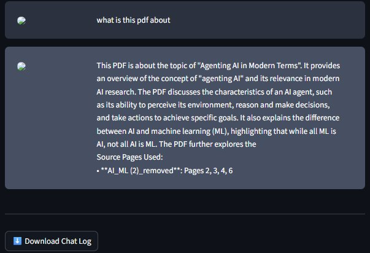

# 📚 Chat with Multiple PDFs

A Streamlit-based RAG (Retrieval-Augmented Generation) application that lets you upload multiple PDF documents and ask questions about them in natural language. Built using LangChain, FAISS vector search, HuggingFace embeddings, and the Llama 3.1 language model.

---

## 🖥️ Application Screenshots

### Main Interface
The clean dark-themed interface with a sidebar for document settings and a main area for asking questions.



### PDF Processing
Upload one or more PDFs, configure chunk settings, and click Process. The app shows live progress as it extracts text page by page.



### Processing Complete
After processing, the app confirms how many chunks were created and which device is being used for embeddings.



### Asking Questions
Type one or more questions (one per line) and click Submit. The app answers each question individually with source page references.



### Answer with Sources
Every answer includes the exact PDF filename and page numbers used to generate the response — full transparency on where the answer came from.



---

## ✨ Features

### 📄 Multi-PDF Upload
- Upload **multiple PDF files** simultaneously (up to 200MB each)
- All documents are processed together into a single searchable knowledge base
- The app displays which documents are currently loaded at the top of the page

### 🔪 Configurable Text Chunking
- **Chunk Size slider** (500–3000 characters): Controls how large each text segment is before being embedded. Larger chunks = more context per answer. Smaller chunks = more precise retrieval.
- **Chunk Overlap slider** (0–500 characters): Controls how much consecutive chunks overlap. Higher overlap prevents important information from being cut at chunk boundaries.
- Both settings are adjustable from the sidebar before processing

### 🔍 Semantic Search with FAISS
- Uses **FAISS** (Facebook AI Similarity Search) for fast vector similarity search
- Each chunk is embedded using `hkunlp/instructor-xl`, a high-quality instruction-following embedding model
- Retrieves the most semantically relevant chunks for each question — not just keyword matching

### 🤖 Llama 3.1 Language Model
- Powered by **Meta's Llama 3.1 8B** model via HuggingFace Inference Endpoints
- Generates natural language answers grounded in the retrieved document chunks
- Low temperature (0.1) keeps answers factual and consistent — appropriate for document Q&A

### ❓ Batch Question Mode
- Ask **multiple questions at once** by separating them with newlines
- Each question is answered independently without cross-contamination between answers
- All answers are displayed in a clean chat-style conversation format

### 📍 Source Page Citation
- Every answer includes **Source Pages Used** showing:
  - The exact PDF filename
  - The specific page numbers the answer was drawn from
- Makes it easy to verify answers against the original documents

### 🧹 Clear Chat History
- One-click **Clear Chat** button resets the entire conversation
- Also clears the LangChain conversation memory so the model starts fresh
- Useful when switching to a new topic or new set of documents

### ⬇️ Download Chat Log
- Export the entire conversation as a plain text `.txt` file
- Includes the document names used and all questions and answers
- Source citation HTML is automatically stripped from the download for clean reading

### 📊 Live Processing Progress
- A **progress bar** shows page-by-page extraction progress during PDF processing
- Displays the current filename and page number being processed
- Shows percentage completion in real time

### 💻 CPU/GPU Awareness
- Automatically detects available hardware and uses CPU by default
- Displays which device is being used for embeddings so you know what to expect performance-wise

### 💬 Conversation Memory
- The main chat uses **ConversationBufferMemory** so the model remembers previous turns
- Batch question mode uses a stateless chain to avoid answers influencing each other

---

## 🗂️ Project Structure

```
pdf-chat/
├── app.py                  ← Main Streamlit application
├── htmlTemplates.py        ← Chat bubble HTML/CSS templates
├── requirements.txt        ← Python dependencies
├── .env.example            ← Template for your API token
├── .env                    ← Your actual token (never commit this)
├── .gitignore              ← Excludes .env, __pycache__, etc.
└── README.md               ← This file
```

---

## ⚙️ Setup — Step by Step

### Step 1: Clone the Repository

```bash
git clone https://github.com/your-username/pdf-chat.git
cd pdf-chat
```

### Step 2: Create a Virtual Environment (Recommended)

```bash
python -m venv venv

# Activate on Windows
venv\Scripts\activate

# Activate on Mac/Linux
source venv/bin/activate
```

### Step 3: Install Dependencies

```bash
pip install -r requirements.txt
```

> ⚠️ The `instructor-xl` embedding model is large (~5GB). First run will download it automatically. Ensure you have sufficient disk space.

### Step 4: Get a HuggingFace API Token (Free)

1. Go to https://huggingface.co and create a free account
2. Click your profile → **Settings** → **Access Tokens**
3. Click **New Token** → give it a name → set role to **Read**
4. Copy the token (starts with `hf_...`)

> 💡 The free HuggingFace token gives you access to Llama 3.1 8B via the Inference API at no cost.

### Step 5: Create Your `.env` File

```bash
cp .env.example .env
```

Open `.env` and paste your token:

```
HUGGINGFACEHUB_API_TOKEN=hf_your_actual_token_here
```

### Step 6: Run the App

```bash
streamlit run app.py
```

The app will open automatically at `http://localhost:8501`

---

## 🚀 How to Use

1. **Upload PDFs** — use the sidebar file uploader to select one or more PDF files
2. **Adjust chunk settings** (optional) — use the sliders to tune chunk size and overlap
3. **Click Process** — wait for the progress bar to complete
4. **Ask questions** — type your question(s) in the text area (one per line for multiple)
5. **Click Submit Questions** — answers appear below with source page references
6. **Download or clear** — use the buttons to export the chat or start fresh

---

## 🧠 How It Works

```
PDF Files
    ↓
Text Extraction (PyPDF2, page by page)
    ↓
Text Chunking (RecursiveCharacterTextSplitter)
    ↓
Embedding (hkunlp/instructor-xl via HuggingFace)
    ↓
Vector Store (FAISS index)
    ↓
User Question
    ↓
Semantic Search → Top K relevant chunks retrieved
    ↓
Llama 3.1 8B generates answer from retrieved chunks
    ↓
Answer + Source Pages displayed in chat
```

---

## 🔧 Configuration

| Setting | Default | Description |
|---|---|---|
| Chunk Size | 1500 chars | Size of each text segment |
| Chunk Overlap | 250 chars | Overlap between consecutive chunks |
| Embedding Model | `hkunlp/instructor-xl` | HuggingFace embedding model |
| LLM | `meta-llama/Llama-3.1-8B` | Language model for answers |
| Temperature | 0.1 | Low = more factual answers |
| Max New Tokens | 100 | Maximum length of each answer |
| Device | CPU | Hardware used for embeddings |

---

## 🛠️ Troubleshooting

**"HUGGINGFACEHUB_API_TOKEN is missing"**
→ Make sure your `.env` file exists and contains the token. Check there are no extra spaces.

**App is slow on first run**
→ The `instructor-xl` model (~5GB) is downloading. Subsequent runs use the cached model.

**"No extractable text found"**
→ Your PDF may be scanned (image-based). This app requires text-based PDFs. Use OCR software first to convert scanned PDFs.

**Answer cuts off mid-sentence**
→ Increase `max_new_tokens` in `get_llm_endpoint()` inside `app.py` (currently set to 100).

**Rate limit errors from HuggingFace**
→ The free tier has request limits. Wait a minute and try again, or upgrade your HuggingFace plan.

---

## 📦 Key Dependencies

| Package | Purpose |
|---|---|
| `streamlit` | Web UI framework |
| `PyPDF2` | PDF text extraction |
| `langchain` | LLM orchestration framework |
| `faiss-cpu` | Vector similarity search |
| `sentence-transformers` | Embedding model support |
| `InstructorEmbedding` | instructor-xl model support |
| `langchain-huggingface` | HuggingFace LLM integration |

---

## 📝 License

This project is open source and available under the MIT License.
